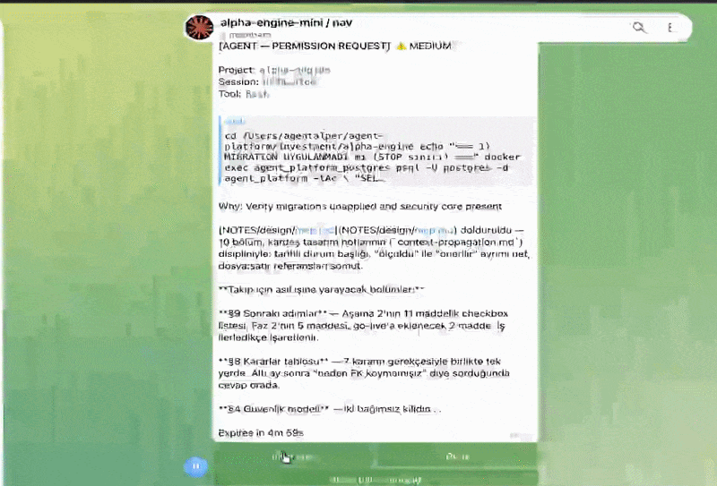

# Halyard Fleet

[](https://github.com/alperarabaci/halyard-fleet/actions/workflows/ci.yml)
[](LICENSE)
[](https://www.python.org/downloads/)

Halyard Fleet puts your coding agent's permission prompt on your phone.

When Claude Code or Codex wants to run something, you see the command, the project it
came from, and how risky it is — then you allow or deny from Telegram. You can also
send new instructions into the running session and read its replies there.

It runs on your own machine. No open ports, no exposed API, nothing to log into.

Nothing is ever approved automatically: every failure — a crash, a timeout, an
unreachable control plane — denies.

**Runtimes:** Claude Code, Codex &nbsp;·&nbsp; **Channel:** Telegram &nbsp;·&nbsp; **Tested on:** macOS

<!-- Demo goes here:
<p align="center">
  
</p>
-->

## Why it exists

Remote desktops, terminal streaming and mobile IDEs all try to move *the machine* to
your phone. Halyard moves *the decisions* instead.

> The user should not operate the computer remotely.
> The user should manage the agent's decisions, direction, state, and coordination.

You are not typing commands on a phone. You are answering the questions your agent
would otherwise be blocked on, from wherever you are.

## Quick start

### 1. Create a Telegram bot

Message [@BotFather](https://t.me/BotFather), send `/newbot`, and keep the token it
gives you. Then message [@userinfobot](https://t.me/userinfobot) to get your own user
id — only ids you list can approve anything.

Create a group for each seat you want to keep separate, and add the bot to each. One
bot covers every group.

### 2. Install

```bash
git clone https://github.com/alperarabaci/halyard-fleet.git
cd halyard-fleet
uv sync --extra dev
```

Requires Python 3.12+ and [uv](https://docs.astral.sh/uv/). It runs on the host, not
in a container — it needs the agent CLIs and their credentials.

### 3. Set it up and run

```bash
uv run halyard init      # asks what you have, writes halyard.yaml, wires it, checks it
uv run halyard           # keep this running
```

`init` asks how many seats you have of each runtime, offers the session names it can
already see, and reads the bot token without echoing it. It backs up any file it
replaces and keeps settings it does not manage.

One file describes a machine: the settings and the seats of every project it
gates. `halyard.yaml` is gitignored, and a real environment variable still
overrides it — so a container can pass a token in without writing it to disk.

> **A wired project depends on this process.** With Halyard down, a Bash command in
> that project is *denied* — all of them — and there is no terminal prompt to approve
> it with. `halyard unwire <path>` hands the project back.
> [The rest of what to expect](docs/before-you-wire-it.md) is worth five minutes
> before you walk away from the machine.

Check it any time with `uv run halyard doctor`, and prove the gate actually stops
things with `uv run halyard verify` — which runs real commands into it rather than
reading configuration.

## Commands

| In Telegram | |
|---|---|
| *(type anything)* | send it into that group's session |
| `/options` | every model and effort level the runtime accepts |
| `/model`, `/effort` | what answers, and how hard it thinks |
| `/to` | hand a message to another seat by name |
| `/md` | *(configurable)* have the agent write its answer to a file and pass the path |
| `/status` | what each seat is, and what is running |
| `/pause`, `/resume` | step out of the way, and come back |

`/md` is one of the `prompts:` in `halyard.yaml` — a sentence you say often
enough to want a name for. Each key there becomes a command. It exists because
a phone is bad at moving text: a long answer arrives split into three messages,
and handing it on means copying each piece while the agent receiving them
starts working on a third of the instruction. Better not to move it at all.

When Claude Code asks a **multiple-choice question** (its `AskUserQuestion`
tool), the options arrive on your phone as buttons — tap one, or reply with your
own answer. The choice goes straight back into the session, and the picker at
the desk never appears. Nobody answers in time, or Halyard is paused, and it
falls back to that picker rather than deciding for you. Claude Code only for now.

| On the machine | |
|---|---|
| `halyard init` | guided setup: `halyard.yaml`, wiring, and a check |
| `halyard doctor` | what is wired, where, and what is broken |
| `halyard verify` | prove the gate stops things, by running into it |
| `halyard wire` / `unwire` | put the gate on a project, or take it off |
| `halyard sessions` | session names this machine can see |
| `halyard service install` | run it as a launchd service (macOS) that updates itself first |

`halyard service install` sets up a launchd agent that comes back after a crash
and after a reboot. Every time it starts it runs `git pull --ff-only`, then
`uv sync`, then serves — so the machine you leave running stays current without
you logging in to update it. The pull is fail-open: it never rewinds or touches
local changes, and a pull it cannot fast-forward is skipped so the last
known-good code still serves. It runs the code it pulls, so point the branch at
a remote you control; `install` prints which one. `uninstall` and `status` do
what they say. macOS only — on Linux, run `halyard serve` under a systemd unit.

## Known limitations

- **The desktop apps show an injected turn late, not never.** A message from your
  phone reaches the session and its reply comes back to you; the app catches up when
  its window is focused again.
- **Two things can outrun the gate.** A hook that exceeds its timeout, and a wrapper
  that cannot start at all, both let the command through. `doctor` checks for the
  second.
- **One bot token per machine.** Telegram's `getUpdates` has a single consumer.
- **`/pause` steps aside rather than denying.** The runtime's own permission list
  then decides, with no card and no audit entry.
- **The gate covers what the matcher covers** — Bash today, not `Write` or `Edit`.
- **Only macOS has been run.** Nothing here is deliberately macOS-only and the
  Linux paths exist, but they have not been exercised: the CLIs are found by
  looking in places a Mac keeps them, and holding the machine awake uses
  `caffeinate`, which simply does nothing elsewhere. Windows is untried
  entirely. If you run it somewhere else, `halyard doctor` is the first thing
  to read and the place a wrong assumption will show up.
- **Antigravity is not shipped.** The adapter works — it gates, it delivers, it
  brings replies back — but a command approved from your phone is still approved a
  second time in the desktop app whenever the agent asks to leave the sandbox.
  Antigravity ignores a hook that tries to grant that, deliberately: honouring it
  would let whoever controls the hook run unsandboxed code on the machine. That is
  the right call, so the runtime waits rather than shipping with a second prompt.
  Everything found along the way is written down in the notes below.

## What this is not

Out of scope, and not arriving later without a stated reason: remote desktop or
terminal streaming, automatic `allow all`, letting a model decide permissions on your
behalf, uncontrolled agent-to-agent messaging, or multi-user RBAC.

## Documentation

| | |
|---|---|
| [Before you wire it in](docs/before-you-wire-it.md) | What changes, and what surprised us |
| [When it does not work](docs/when-it-does-not-work.md) | Every way setup has gone wrong so far, and the fix |
| [Setup](docs/setup.md) | Installing it, seats in YAML, gating a project by hand |
| [Telegram](docs/telegram.md) | The bot, seats, models and effort |
| [Architecture](docs/architecture.md) | How the layers fit, and the security posture |
| [Hook behaviour](docs/hook-payload-notes.md) | What the runtimes' hooks actually do — measured |
| [Session I/O](docs/session-io-notes.md) | Writing into a live session, and what forks it |
| [Antigravity notes](docs/antigravity-payload-notes.md) | A third runtime, measured in full and not shipped — and why |
| [Design document](docs/mobile-agent-control-plane.md) | The full plan this is built from |

## Development

```bash
uv run pytest
uv run ruff check .
```

## License

[MIT](LICENSE) © alper arabaci
